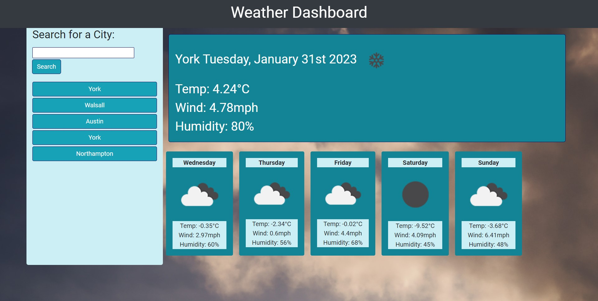
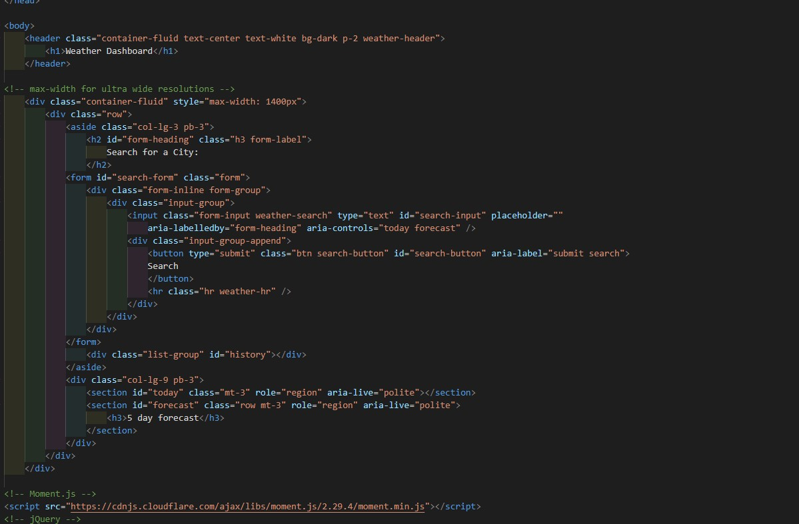
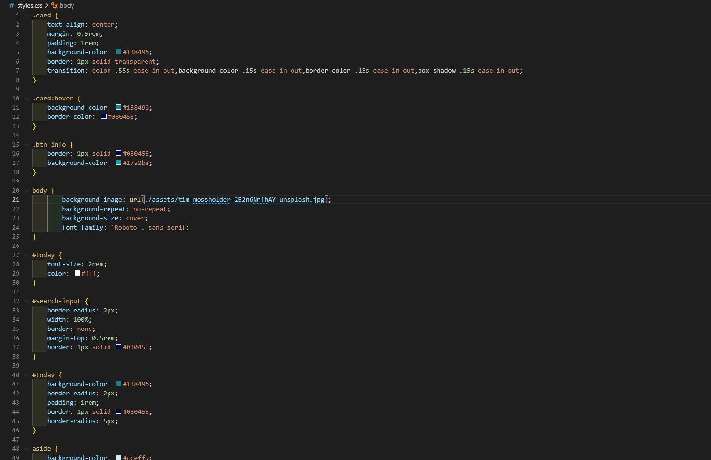

# weather-app

## Overview

A dashboard that allows a user to search for a city and then displays todays weather and a five day forecast

## Acceptance Criteria

* Create a weather dashboard with form inputs.
  * When a user searches for a city they are presented with current and future conditions for that city and that city is added to the search history
  * When a user views the current weather conditions for that city they are presented with:
    * The city name
    * The date
    * An icon representation of weather conditions
    * The temperature
    * The humidity
    * The wind speed
  * When a user view future weather conditions for that city they are presented with a 5-day forecast that displays:
    * The date
    * An icon representation of weather conditions
    * The temperature
    * The humidity
  * When a user click on a city in the search history they are again presented with current and future conditions for that city

## Site & Repo
* [Site](https://dj-86.github.io/weather-app/)
* [Repo](https://github.com/DJ-86/weather-app)

## Resources:
* [localStorage](https://developer.mozilla.org/en-US/docs/Web/API/Window/localStorage)
* [OpenWeather API](https://openweathermap.org/api)
* [JQuery](https://jquery.com/)
* [Moment.js](https://momentjs.com/)
* [Bootstrap](https://getbootstrap.com/)

## Screenshots

## License
* [MIT](LICENSE.md)
